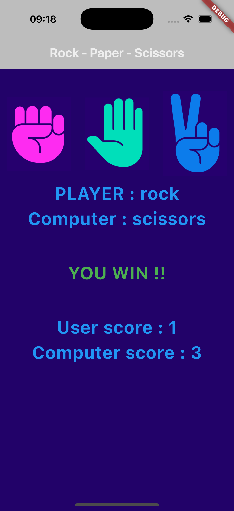

# Rock-Paper-Scissors Flutter Game 🎮

A **Rock-Paper-Scissors** game built with **Flutter** and **Dart** as part of my journey to learn mobile app development. This project was created to apply and solidify my understanding of Flutter fundamentals, including state management, UI design, and basic game logic.

---

## About the Project 📖
This project was developed to practice and apply the following concepts:
- **State Management**: Using `setState` to manage and update the game state.
- **UI Design**: Creating a clean and interactive user interface with Flutter widgets.
- **Game Logic**: Implementing the rules of Rock-Paper-Scissors and simulating a computer opponent.
- **Asset Management**: Loading and displaying images from the app's assets.

It’s a simple yet effective way to demonstrate my ability to build a functional app while reinforcing my understanding of core Flutter concepts.

---

## Features ✨
- **Interactive UI**: Buttons for Rock, Paper, and Scissors with custom images.
- **Game Logic**: Random computer choice generation and result calculation.
- **Score Tracking**: Real-time tracking of the user's and computer's scores.
- **Dynamic Feedback**: Instant feedback on the game result (Win, Lose, or Draw) with color-coded messages.

---

## Screenshots 📸
  
*Caption: Main game screen with Rock, Paper, and Scissors buttons.*

  
*Caption: Game result and score display.*

---

## What I Learned 🧠
Through this project, I gained hands-on experience with:
- **Flutter Basics**: Widgets, layouts, and navigation.
- **State Management**: Using `setState` to update the UI dynamically.
- **Game Development**: Implementing simple game logic and rules.
- **Debugging**: Identifying and fixing issues during development.
- **Version Control**: Managing the project with Git and GitHub.

---

## How to Play 🕹️
1. Tap on one of the three buttons (Rock, Paper, or Scissors) to make your choice.
2. The computer will randomly select its choice.
3. The game will determine the winner based on the classic Rock-Paper-Scissors rules.
4. The scores will be updated, and the result will be displayed on the screen.
## Installation 🚀

Follow these steps to set up and run the project on your local machine:

1. **Clone the repository**:
   ```bash
   git clone https://github.com/your-username/rock-paper-scissor.git
2. **Navigate to the project directory:**
   ```bash
   cd rock-paper-scissor

3. **:Install dependencies:**
   ```bash
   flutter pub get
4. **Run the app:**
   ```bash
   flutter run

## Future Improvements 🔮

While this project was primarily for learning, here are some ideas for future enhancements:

- **Add Animations**: Introduce animations for the Rock, Paper, and Scissors buttons to make the game more visually engaging.
- **Implement Sound Effects and Background Music**: Add sound effects for button clicks, wins, losses, and background music to enhance the gaming experience.
- **Multiplayer Mode**: Develop a multiplayer mode where users can play against friends online.
- **Firebase Integration**: Integrate Firebase for global score tracking, leaderboards, and user authentication.
- **Advanced UI/UX**: Improve the user interface with modern design elements and better responsiveness.
- **Localization**: Add support for multiple languages to make the game accessible to a wider audience.
- **Game History**: Implement a feature to view past game results and statistics.
- **Custom Themes**: Allow users to choose from different themes (e.g., dark mode, light mode, or custom colors).
- **AI Difficulty Levels**: Add different difficulty levels for the computer opponent (e.g., easy, medium, hard).
- **Social Sharing**: Enable users to share their scores or results on social media platforms.

---

### Open to Contributions!
If you have any ideas or would like to contribute to these improvements, feel free to open an issue or submit a pull request. Let’s make this game even better together! 😊
