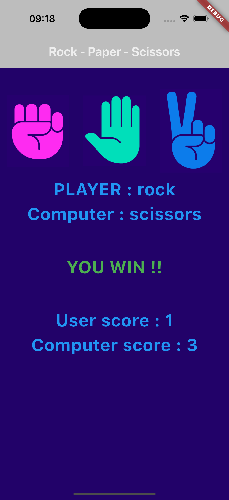

# Rock-Paper-Scissors Flutter Game 🎮

A simple yet engaging **Rock-Paper-Scissors** game built with **Flutter** and **Dart**. This project demonstrates my skills in Flutter development, state management, and UI design. It’s a fun and interactive game where users can play against the computer and track their scores.

---

## Features ✨
- **Interactive UI**: Clean and visually appealing user interface with custom images for Rock, Paper, and Scissors.
- **Game Logic**: Implements the classic Rock-Paper-Scissors rules with a random computer choice generator.
- **Score Tracking**: Keeps track of the user's and computer's scores in real-time.
- **Responsive Design**: Works seamlessly on both iOS and Android devices.
- **Dynamic Feedback**: Provides instant feedback on the game result (Win, Lose, or Draw) with color-coded messages.

---

## Screenshots 📸
  
*Caption: Main game screen with Rock, Paper, and Scissors buttons.*

  
*Caption: Game result and score display.*

---

## Technologies Used 🛠️
- **Flutter**: For building the cross-platform mobile application.
- **Dart**: For implementing the game logic and state management.
- **Material Design**: For creating a consistent and modern UI.
- **Random Number Generation**: For simulating the computer's choice.

---

## How to Play 🕹️
1. Tap on one of the three buttons (Rock, Paper, or Scissors) to make your choice.
2. The computer will randomly select its choice.
3. The game will determine the winner based on the classic Rock-Paper-Scissors rules.
4. The scores will be updated, and the result will be displayed on the screen.

---

## Installation 🚀
1. Clone the repository:
   ```bash
   git clone https://github.com/your-username/rock-paper-scissor.git
